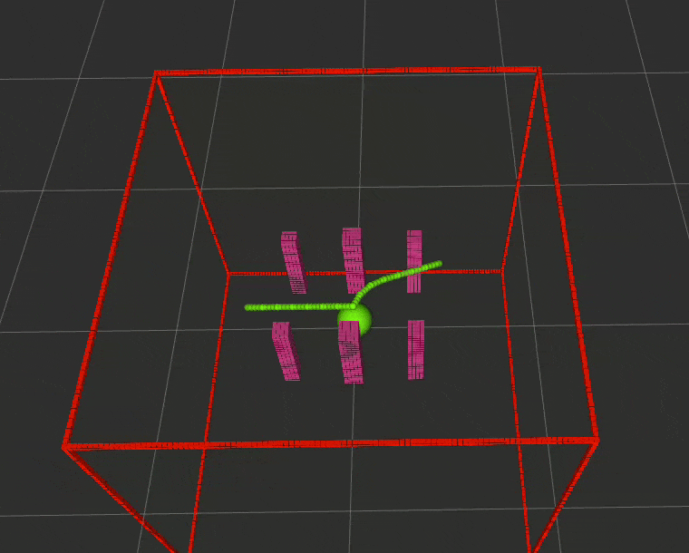
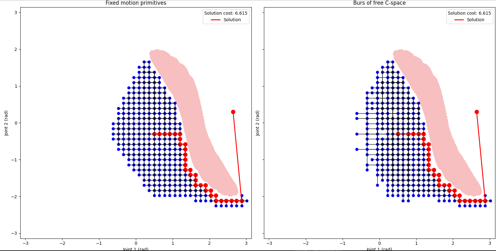

# Bur Search Motion Planning
 Motion planning for robotic manipulators that combines sampling-based and search-based planning methods. Distance-based burs[1] of free configuration space (C-space) are used as adaptive motion primitives within the graph search algorithm. The algorithm is implemented within the existing SMPL (Search-Based Motion Planning Library) library.

 :page_facing_up: Paper: [Search-Based Robot Motion Planning With Distance-Based Adaptive Motion Primitives](https://arxiv.org/abs/2507.01198)

## :rewind: Prerequisites
Docker is required and can be installed from this [link](https://docs.docker.com/get-started/get-docker/).
## :hammer_and_wrench: Build
1. Clone this repository recursively and navigate to the right directory:
    ```bash
    git clone --recurse-submodules https://github.com/benjaminkraljusic/bur_search_motion_planning.git && cd bur_search_motion_planning
    ```
2. Call the Docker image building script:
    ```bash
    ./bur_search_utils/bash_scripts/build-docker.sh
    ```
    Done.
## :running: Running
In the terminal, from the cloned directory that was previously navigated to, run:
```bash
./bur_search_utils/bash_scripts/run-docker.sh
```
The Docker container named **bur_search_container** is now running with the terminal attached. The commands in the following sections should be run in the same terminal, unless stated otherwise.
## :computer: Usage
The project can be used as:
- A development environment for search-based robot motion planning using SMPL and/or burs of free C-space.
- A framework for comparing classical motion-primitive planning with the proposed approach using burs of free C-space as adaptive motion primitives by running given examples.

### Development environment
The directory containing the source code is mounted as a volume inside the Docker container, which means that any changes made in the cloned directory on the host machine are reflected in the container as well. As a result, it is not necessary to rebuild the Docker image every time the source code changes.

The project uses standard [catkin workspace](https://wiki.ros.org/catkin/workspaces) structure. To navigate to the workspace directory, run:
```bash
cd /ws
```
To build the code, run the following command inside the workspace:
```bash
catkin build
```
### Running examples
1. Start the ROS master:
    ```bash
    roscore
    ```
2. Open another terminal and attach it to the running Docker container:
    ```bash
    docker exec -it bur_search_container bash -c "source devel/setup.bash; bash"
    ```
    > **_NOTE:_**  Every shell attached to the running container must have the ROS environment properly set up; hence the *source devel/setup.bash* part of the previous command.

3. Run one of the following examples:
    - ```bash 
      src/bur_search_utils/bash_scripts/manip_vs_manip_dist_7DoF.sh 
      ```
    <p align="center">
        
    </p>

    - ```bash 
      src/bur_search_utils/bash_scripts/manip_vs_manip_dist_2DoF.sh 
      ```

    <p align="center">
        
    </p>

    - ```bash 
      src/bur_search_utils/bash_scripts/evaluate_bur_smpl_7DoF.sh 
      ```
    - ```bash 
      src/bur_search_utils/bash_scripts/evaluate_bur_smpl_2DoF.sh 
      ```
      The final two examples run a comparison between the classical motion primitive planning and the planning that utilizes burs of free configuration space. Evaluation is performed for 2 degrees of freedom and 7 degrees of freedom across three planning scenarios of different complexities. Scenarios and results are stored in:
      ```bash
      bur_search_motion_planning/bur_search_utils/experiments
      ```
      The results can be visualized by running:
      ```bash
      python3 bur_search_motion_planning/bur_search_utils/python_scripts/plot_bur_smpl_search_results_time_exp_init.py
      ```
## :link: Links
 - [SMPL](https://github.com/gsotirchos/smpl) by Search-Based Planning Lab
 - [SBPL](https://github.com/sbpl/sbpl) by Search-Based Planning Lab
## :books: References
[1] B. Lacevic et al., *Burs of Free C-Space: A Novel Structure for Path Planning*, IEEE ICRA 2016. https://doi.org/10.1109/ICRA.2016.7487117
